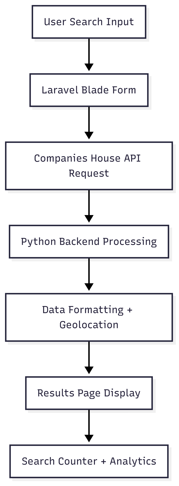
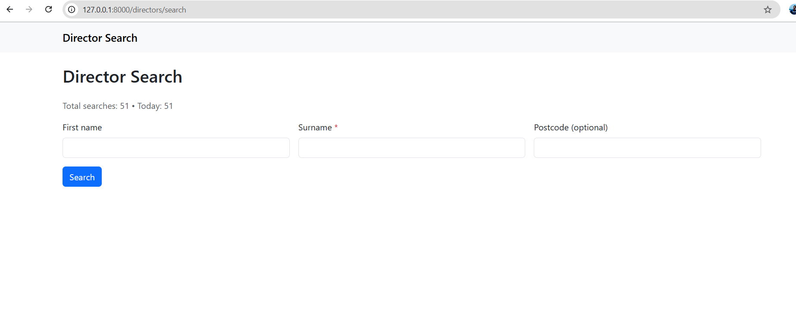
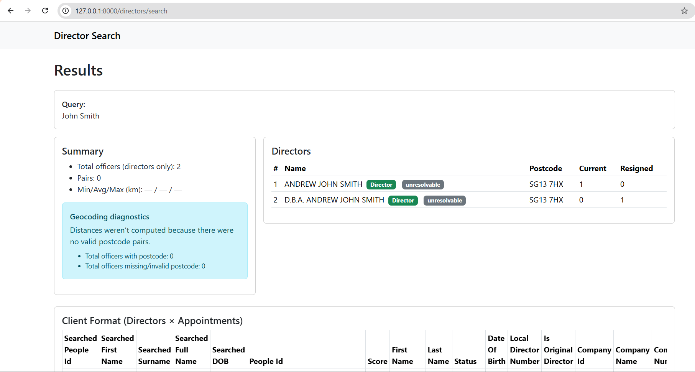

# 🕵️‍♂️ Director Search Application

[](https://github.com/kamaalmohd79/Director_search)

---

## 📖 Overview
The **Director Search Application** is a web-based tool that integrates with the **Companies House API** to provide detailed director information along with geolocation analysis.  

It is built with **Laravel (PHP)** for the frontend and **Python** for backend processing.

---

## ❓ What is the Director Search Application?
It is a powerful tool that allows users to **search company directors** by first name, surname, and postcode, then view:
- Associated companies
- Full addresses
- Geographical distances between directors

---

## 🎯 Purpose
The purpose of this application is to:
- Simplify the retrieval of **official director data** from the Companies House API  
- Provide users with a **clean UI** for searching and analyzing directors  
- Enable **geolocation insights** such as distance calculations between directors  

---

## 💡 Why Use This Project?
- ✅ Direct integration with **Companies House API**  
- ✅ Quick access to director and company data  
- ✅ **Geolocation distance matrix** between addresses  
- ✅ Open-source and extensible for future enhancements  

---

## 🚀 Features
- 🔍 **Search Directors** by first name, surname, or postcode  
- 🏢 **Retrieve Company Information** linked to directors  
- 📍 **Geolocation Calculations** between director addresses  
- 📊 **Search Analytics & Counters**  
- 🎨 User-friendly **Blade UI templates**  

---

## 🛠️ Frameworks Used
- **Laravel 10+ (PHP 8.1+)** → Web application & Blade views  
- **Python 3.8+** → API data processing & geolocation logic  
- **MySQL / SQLite** → Storing counters & session management  
- **Companies House API** → Director & company data source  

---

## 📈 Expected Result
After performing a search:
- The app retrieves **directors’ details** from Companies House API  
- Displays **names, companies, and addresses** in a structured layout  
- Shows **calculated distances** between director addresses  
- Provides **search statistics**  

---

## 📂 Project Scaffold & Structure
```bash
Director_search/
│── app/                  # Laravel application code
│── resources/views/      # Blade templates (UI)
│── routes/web.php        # Web routes
│── public/               # Public assets
│── python/               # Python backend scripts
│── database/             # Migrations & models
│── .env                  # Environment config (API keys, DB)
│── composer.json         # PHP dependencies
│── requirements.txt      # Python dependencies
```

---
## 🔄 Execution Flow

<br>

---

## 🗂️ Data Pipeline

<br>

---

## 📸 Screenshots

### Input Screen

<br>

### Result Screen



---

## ⚡ Quick Start

### 1️⃣ Installation

    ```bash
    # Clone repo
    git clone https://github.com/kamaalmohd79/Director_search.git

    cd Director_search
    # Install PHP dependencies
    composer install

    # Install Python dependencies
    pip install -r python/requirements.txt

    # Setup environment file
    cp .env.example .env
    php artisan key:generate

    # Run migrations
    php artisan migrate
    ```
### 2️⃣ Run Localhost

    ```bash
    # Start Laravel
    php artisan serve

    # Start Python processing (if required)
    python python/main.py
    ```

---

## ⚙️ How It Works

- User enters search criteria in the form
- Laravel sends a request to Companies House API
- Python backend processes and formats data
- Geolocation engine calculates distance matrix
- Blade templates render results with analytics

---

## 🧑‍💻 Tech Stack

- Backend: PHP (Laravel), Python
- Frontend: Blade Templates, Bootstrap
- Database: MySQL/SQLite
- API: Companies House API

---

## 📦 Python Requirements

- requests
- pandas
- geopy
- jsonlib

    (See python/requirements.txt for full list)

---

## 🤝 Contributing

- Contributions are welcome!
- Fork the repo
- Create your branch (git checkout -b feature-xyz)
- Commit changes (git commit -m "Add feature xyz")
- Push and create a PR

---

## 📜 License

This project is licensed under the MIT License.

---

## 🙌 Credits

Developer: Mohammad. Kamaal<br>
Prepared By (SOW): Raj Ahmed – Funding Alt<br>  
Data Source: Companies House API

---